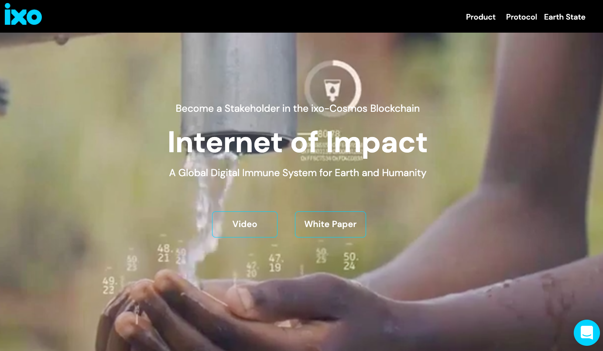
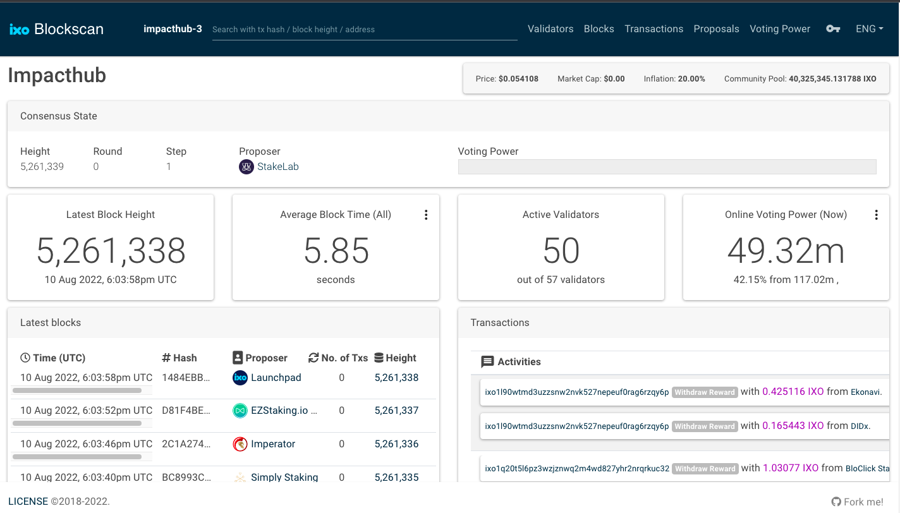
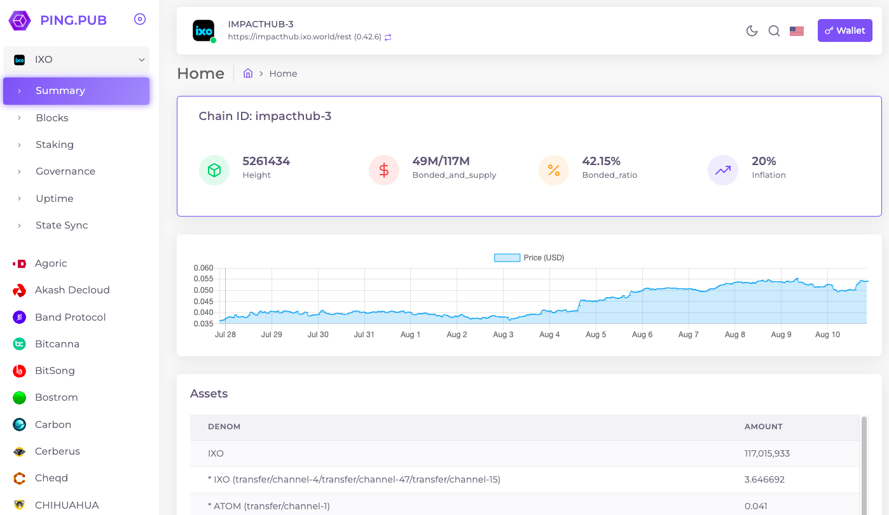
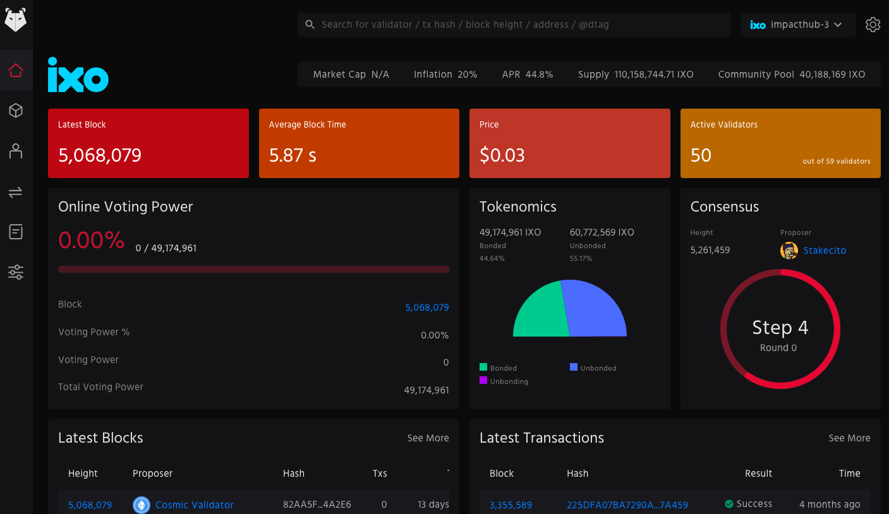
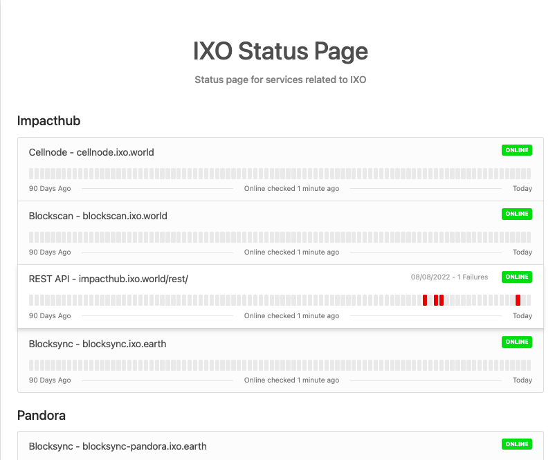
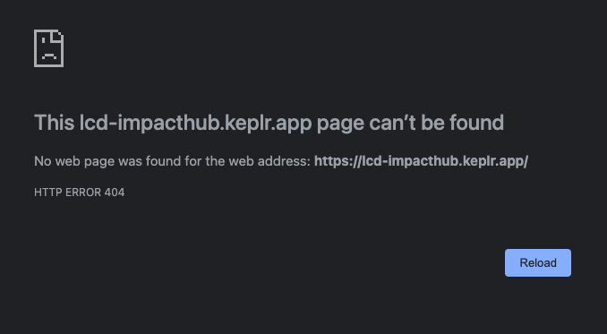
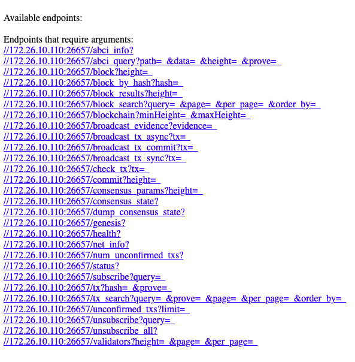
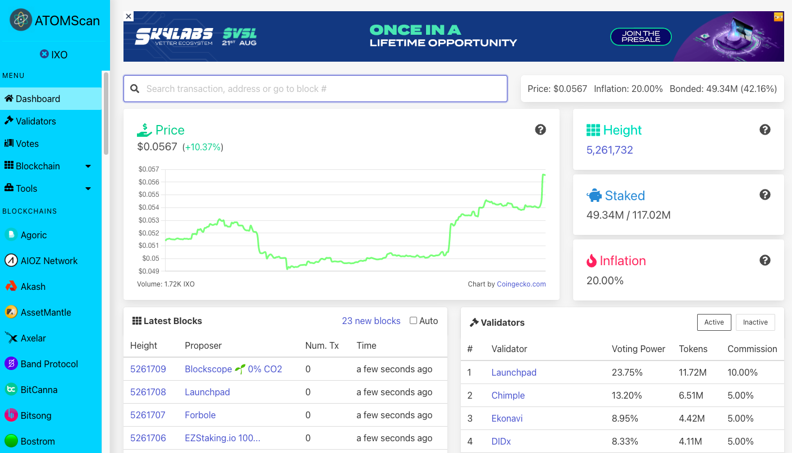
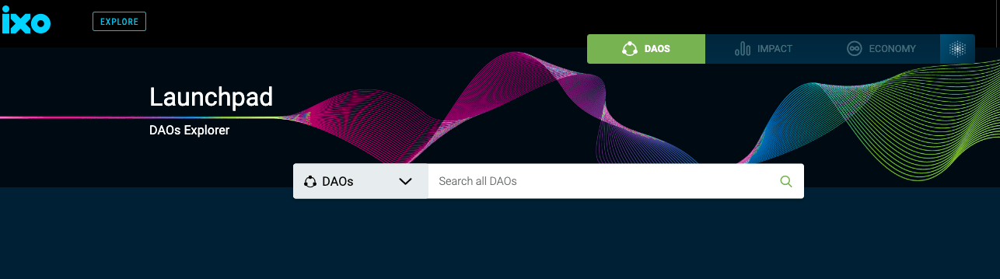

# Documentation

The starting point for learning about all things ixo - welcome!

  <a href="overview/" class="card">
    
    

      Overview
    

    

      The high-level overview of how ixo works.
    

  </a>
  <a href="develop/" class="card">
    
    

      Develop
    

    

      The way to get yourself set up and to start building.
    

  </a>

  <a href="validate/" class="card">
    
    

      Validate
    

    

      You can become one of the validators on ixo to earn IXO and to help secure the network.
    

  </a>

  <a href="integrate/" class="card">
    
    

      Create
    

    

      Rapidly create your own dApp using the ixo JAMBO EarthPort Web Kit.
    

  </a>

 

  <a href="https://www.ixo.world/" class="card lg" target="_blank">
    
    

     ixo.world
    

    

      Read all about us.
    

  </a>
<a href="https://discord.gg/xFSdGBAw" class="card lg" target="_blank">
    
    

     Discord
    

    

      Join the ixo community on Discord.
    

  </a>
  <a href="https://github.com/ixofoundation/documents" class="card lg" target="_blank">
    
    

    Suggestions or Issues?
    

    

    Help us to improve this page on Github.
    

  </a>

 

# Impact Hub Resources
 
 

  <a href="https://blockscan.ixo.world/" class="card lg" target="_blank">
    
    

     Blockscan by ixoworld
    

    

     Block Explorer
    

  </a>
  <a href="https://ping.pub/ixo" class="card lg" target="_blank">
    
    

     Ping.Pub
    

    

     Block Explorer
    

  </a>
  <a href="https://explorer.ixo.earth/" class="card lg" target="_blank">
    
    

     Big Dipper by DIDx
    

    

     Block Explorer
    

  </a>

 

  <a href="https://status.ixo.earth/" class="card lg" target="_blank">
    
    

      ixo Status Page
    

    

     Network availability status
    

  </a>
  <a href="https://lcd-impacthub.keplr.app/" class="card lg" target="_blank">
    
    

     ixo LCD
    

    

     Hosted by Chainapsis
    

  </a>
  <a href="https://impacthub.ixo.world/rpc/" class="card lg" target="_blank">
    
    

     ixo RPC
    

    

     Hosted by ixoworld
    

  </a>

 

  <a href="https://atomscan.com/ixo/" class="card lg" target="_blank">
    
    

     ATOMScan
    

    

     Block Explorer
    

  </a>
  <a href="https://launchpad.ixo.world/" class="card lg" target="_blank">
    
    

     ixo LaunchPad
    

    

     Join as a relayer
    

  </a>
    <a href="https://impacthub.ixo.world/rest/" class="card lg" target="_blank">
    
    

     REST
    

    

     Hosted by ixoworld
    

  </a>

